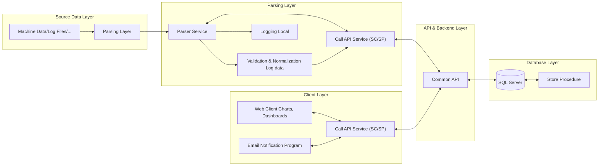

## Table of Contents
* [Installation](#installation)
* [Usage](#usage)
* [Features](#features)
* [Configuration](#configuration)
* [Project Flow](#project-flow)
* [Project Structure](#project-structure)
* [Technologies](#technologies)
* [Development](#development)
* [Testing](#testing)
* [Contributing](#contributing)
* [Issues](#issues)
* [Troubleshooting](#troubleshooting)

## Installation

1. **Clone the repository:**
   ```bash
   git clone <repository-url>
   cd Monaco_Hold_Lot_Management
   ```

2. **Install dependencies:**
   This project uses npm for package management.
   ```bash
   npm install
   ```

## Usage

- **Development:** Run the application in development mode with hot-reloading.
  ```bash
  npm run dev
  ```
- **Production Build:** Compile and minify for production.
  ```bash
  npm run build
  ```
- **Lint:** Run ESLint to check for code quality.
  ```bash
  npm run lint
  ```

## Features

- **User Authentication:** Login functionality.
- **Administrator:**
    - User Management
    - Role Management
- **Approval System:**
    - Approve incoming requests.
    - View personal approval history.
- **Hold Lot Management:**
    - Dashboard with charts and tables.
    - History of hold lots.

## Configuration

The project configuration is managed through environment files:
- `.env.development`: For development environment.
- `.env.production`: For production environment.

These files are used to store sensitive information like API endpoints and database credentials.

## Project Flow

1.  The user is prompted to **Login** (`src/modules/core/pages/Login.vue`).
2.  Upon successful authentication, the user is redirected to the main application layout (`src/layout/AppLayout.vue`).
3.  The main layout consists of a top bar, a sidebar/menu, and the main content area.
4.  Routing is handled by `vue-router`, with main routes defined in `src/router/index.js` and module-specific routes in `src/modules/*/router.js`.
5.  Users can navigate to different modules like Hold Lot Management, Approvals, or Admin pages through the menu.

## Project Structure

```
/
├── public/              # Static assets
├── src/
│   ├── assets/          # Styles and images
│   ├── layout/          # Main application layout components
│   ├── modules/         # Core application features separated by domain
│   │   ├── admin/
│   │   ├── approval/
│   │   ├── core/        # Core services like Auth
│   │   ├── holdLotManagement/
|   |   ├── equipmentMonitoring/
|   |   └── hccControlPage/
│   ├── plugin/          # Third-party plugin configurations
│   ├── router/          # Vue Router configuration
│   └── main.js          # Main entry point
├── .env.development     # Development environment variables
├── .env.production      # Production environment variables
├── index.html           # Main HTML file
├── package.json         # Project dependencies and scripts
└── vite.config.mjs      # Vite configuration
```

## Technologies

- **Frontend:**
    - [Vue.js](https://vuejs.org/)
    - [Vite](https://vitejs.dev/)
    - [Tailwind CSS](https://tailwindcss.com/)
    - [PrimeVue](https://www.primefaces.org/primevue/) (likely, based on structure)
    - [Highcharts](https://www.highcharts.com/)
- **Development:**
    - [ESLint](https://eslint.org/)
    - [Prettier](https://prettier.io/)

## Development

To start the development server, run:
```bash
npm run dev
```
The application will be available at `http://localhost:3006` (or another port if specified in the Vite config).

## Testing

There are currently no automated tests configured for this project.

## Contributing

Contributions are welcome! Please follow these steps:
1.  Fork the repository.
2.  Create a new branch (`git checkout -b feature/YourFeature`).
3.  Commit your changes (`git commit -m 'Add some feature'`).
4.  Push to the branch (`git push origin feature/YourFeature`).
5.  Open a Pull Request.

## Issues

If you encounter any bugs or have feature requests, please open an issue on the project's GitHub repository.

## Troubleshooting

- If you encounter dependency-related issues, try deleting the `node_modules` directory and the `package-lock.json` file, then run `npm install` again.
- Ensure that your `.env.development` file is correctly configured with the necessary environment variables.

## Data Flow
### 1. Hold Lot Management
### 2. Equiment Monitoring

